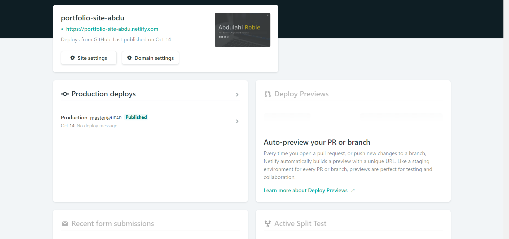
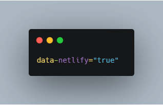
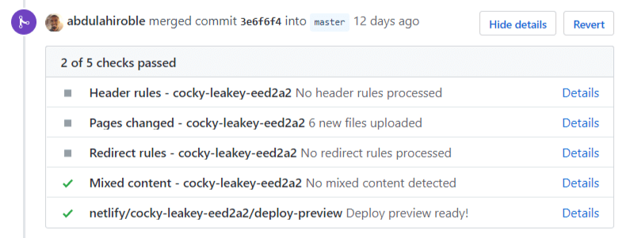

There was a time when hosting a website used to be complicated and quite expensive. Luckily we now have different services like Netlify, which makes deploying websites a seamless experience.

Just to be transparent, this post is not sponsored by Netlify or anything. I just really like their service and have published a good amount of sites on their platform.

And so with that in mind, here are five reasons why you might want to consider using Netlify the next time you want to publish a static site.

## 1. Hosting & Price

Properly the best thing about Netlify is its different plans and what they offer in terms of perks. For example, they have a starter plan which offers:

- Custom domains & HTTPS
- Instant Git integration
- Continuous deployment
- Deploy previews

And the total cost of all that comes down to zero. Hosting is done through a CDN, which speeds up website performance significantly.

## 2. Easy to use dashboard

The dashboard gives you a good overview of everything from deploys to previews, and it is just overall easy to navigate if you want to make some changes on your site.

## 3. Great documentation

Netlifys documentation is very comprehensive and easy to understand. They have sections that range from configuring builds to setting up your custom domain, which I from the beginning had some problems with, but thanks to the documentation were able to resolve quickly.

Also, the documentation has recently been updated so that it now becomes even more self-explanatory. You can check it out here:

<a href="https://docs.netlify.com/#get-started" target="_blank" rel="noopener noreferrer">https://docs.netlify.com/#get-started</a>

## 4. Form submission

Setting up a form using Netlify is a straightforward process that includes nothing more than adding this piece of code at the beginning of your form tag:

Previously if you wanted to add a form to your website, you had to use server-side code like PHP or JavaScript. It also comes with a default success page after the form has been submitted, or you can create your own one.

All successful form submissions will show up in your dashboard, and you can even integrate it with your email using Zappier, which is an integration tool.

With the starter plan, you can make up to 100 form submissions per month, which should be enough if it is just your portfolio site. If not, then you can always upgrade to a level 1 account, but that does cost, however.

## 5. Continuous deployment

Another great feature is its continuous deployment, which links to your repository, and every time you push your code, Netlify runs a build tool and deploys the result.

There is still a lot more to cover, but instead of saying it here, I would much rather have you go out and explore it for yourself. Maybe you can start by publishing your portfolio site on Netlify like I did the first time.

As for myself, I still feel like I barely scratched the surface in terms of trying out all of the features Netlify has to offer.

One feature I am particularly interested in trying out is split testing, which lets me test different designs of my portfolio site by serving multiple branch deploys.
